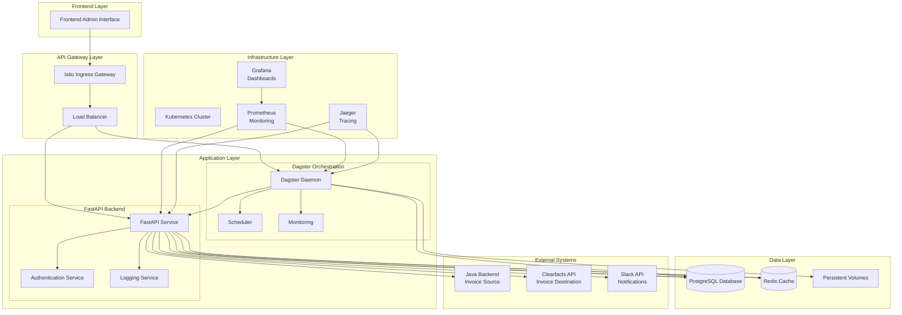
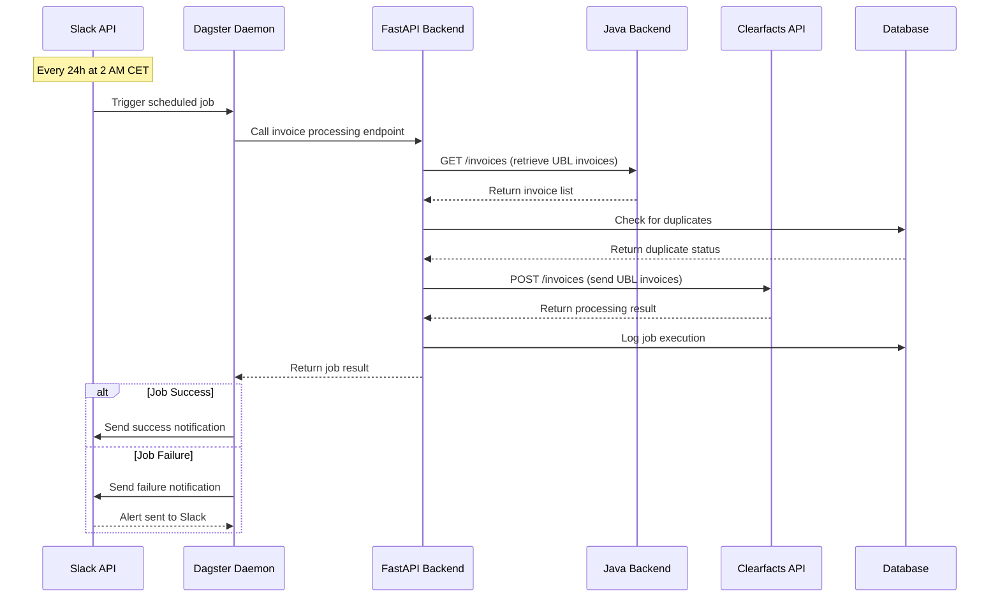
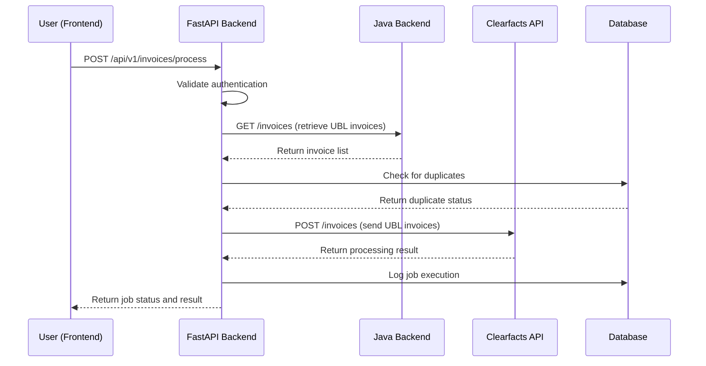
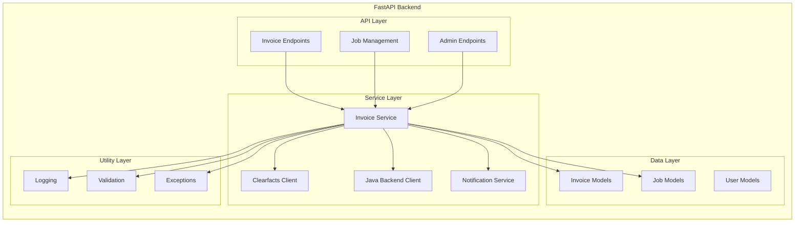
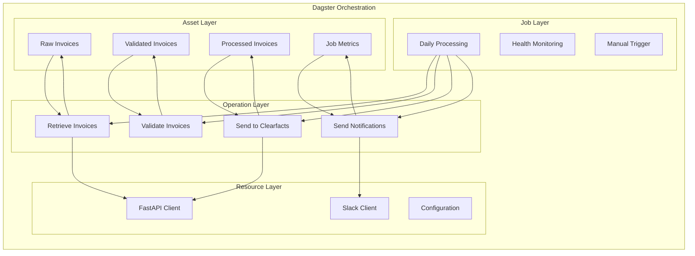
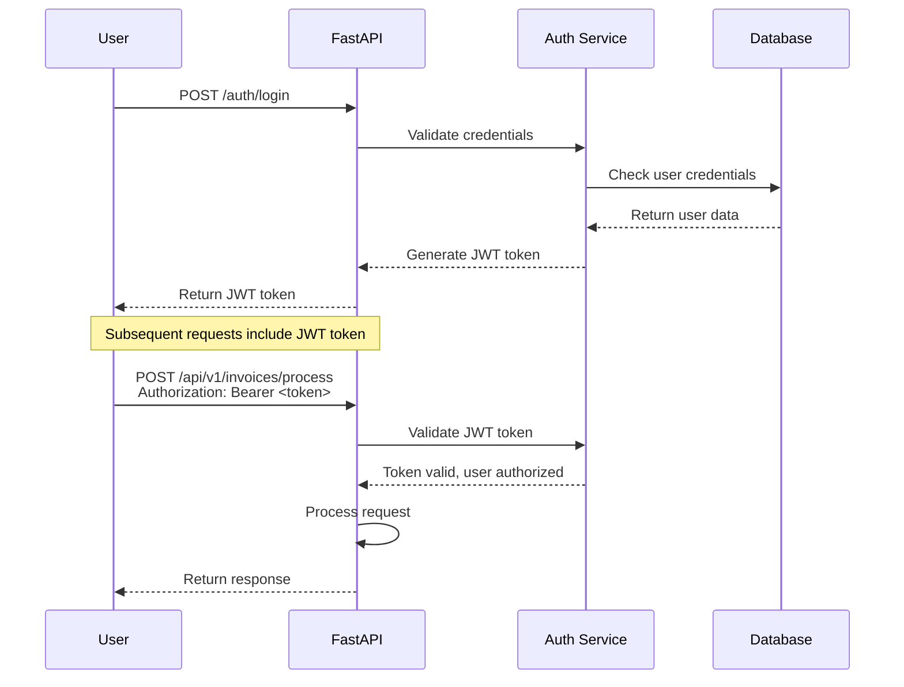
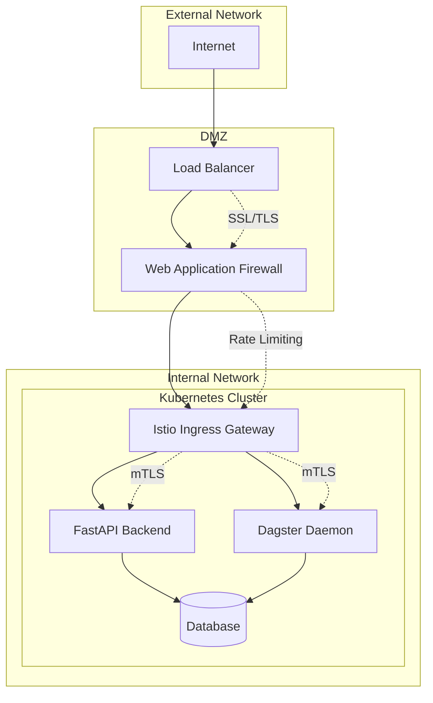
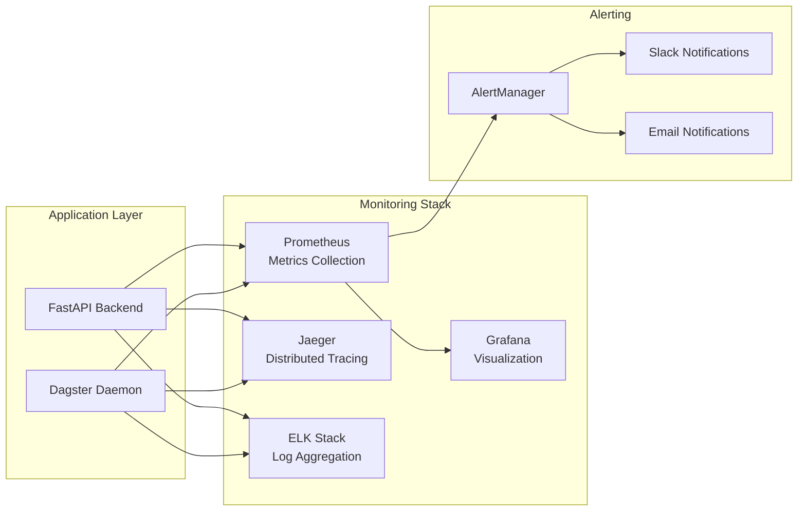

# System Architecture & Schema Documentation

## Overview
This document provides a comprehensive overview of the Clearfacts invoice integration system architecture, including system diagrams, data flow schemas, and component interactions.

## System Architecture Diagram



## Data Flow Architecture

### 1. Scheduled Invoice Processing Flow



### 2. Manual Invoice Processing Flow



## Component Architecture

### 1. FastAPI Backend Components



### 2. Dagster Orchestration Components



## Database Schema

### 1. Core Tables

```sql
-- Users table for authentication
CREATE TABLE users (
    id UUID PRIMARY KEY DEFAULT gen_random_uuid(),
    username VARCHAR(255) UNIQUE NOT NULL,
    email VARCHAR(255) UNIQUE NOT NULL,
    password_hash VARCHAR(255) NOT NULL,
    role VARCHAR(50) NOT NULL DEFAULT 'user',
    is_active BOOLEAN DEFAULT TRUE,
    created_at TIMESTAMP DEFAULT CURRENT_TIMESTAMP,
    updated_at TIMESTAMP DEFAULT CURRENT_TIMESTAMP
);

-- Jobs table for tracking invoice processing jobs
CREATE TABLE jobs (
    id UUID PRIMARY KEY DEFAULT gen_random_uuid(),
    job_type VARCHAR(50) NOT NULL, -- 'scheduled', 'manual'
    status VARCHAR(50) NOT NULL, -- 'pending', 'running', 'completed', 'failed'
    triggered_by UUID REFERENCES users(id),
    started_at TIMESTAMP,
    completed_at TIMESTAMP,
    error_message TEXT,
    metadata JSONB,
    created_at TIMESTAMP DEFAULT CURRENT_TIMESTAMP,
    updated_at TIMESTAMP DEFAULT CURRENT_TIMESTAMP
);

-- Invoices table for tracking processed invoices
CREATE TABLE invoices (
    id UUID PRIMARY KEY DEFAULT gen_random_uuid(),
    job_id UUID REFERENCES jobs(id),
    invoice_id VARCHAR(255) NOT NULL,
    ubl_data TEXT NOT NULL,
    status VARCHAR(50) NOT NULL, -- 'pending', 'sent', 'failed', 'duplicate'
    clearfacts_response JSONB,
    error_message TEXT,
    processed_at TIMESTAMP,
    created_at TIMESTAMP DEFAULT CURRENT_TIMESTAMP,
    updated_at TIMESTAMP DEFAULT CURRENT_TIMESTAMP
);

-- Audit logs table for tracking all operations
CREATE TABLE audit_logs (
    id UUID PRIMARY KEY DEFAULT gen_random_uuid(),
    user_id UUID REFERENCES users(id),
    action VARCHAR(100) NOT NULL,
    resource_type VARCHAR(50) NOT NULL,
    resource_id UUID,
    details JSONB,
    ip_address INET,
    user_agent TEXT,
    created_at TIMESTAMP DEFAULT CURRENT_TIMESTAMP
);

-- Configuration table for system settings
CREATE TABLE configuration (
    id UUID PRIMARY KEY DEFAULT gen_random_uuid(),
    key VARCHAR(255) UNIQUE NOT NULL,
    value TEXT NOT NULL,
    description TEXT,
    is_encrypted BOOLEAN DEFAULT FALSE,
    created_at TIMESTAMP DEFAULT CURRENT_TIMESTAMP,
    updated_at TIMESTAMP DEFAULT CURRENT_TIMESTAMP
);
```

### 2. Indexes for Performance

```sql
-- Performance indexes
CREATE INDEX idx_jobs_status ON jobs(status);
CREATE INDEX idx_jobs_created_at ON jobs(created_at);
CREATE INDEX idx_jobs_job_type ON jobs(job_type);

CREATE INDEX idx_invoices_job_id ON invoices(job_id);
CREATE INDEX idx_invoices_status ON invoices(status);
CREATE INDEX idx_invoices_invoice_id ON invoices(invoice_id);
CREATE INDEX idx_invoices_processed_at ON invoices(processed_at);

CREATE INDEX idx_audit_logs_user_id ON audit_logs(user_id);
CREATE INDEX idx_audit_logs_action ON audit_logs(action);
CREATE INDEX idx_audit_logs_created_at ON audit_logs(created_at);

CREATE INDEX idx_configuration_key ON configuration(key);
```

## API Schema Definitions

### 1. Invoice Processing Request/Response

```json
{
  "request": {
    "endpoint": "POST /api/v1/invoices/process",
    "headers": {
      "Authorization": "Bearer <jwt_token>",
      "Content-Type": "application/json"
    },
    "body": {
      "force_processing": false,
      "invoice_ids": ["optional", "specific", "invoice", "ids"]
    }
  },
  "response": {
    "success": true,
    "data": {
      "job_id": "uuid",
      "status": "pending",
      "estimated_completion": "2024-01-15T10:30:00Z",
      "message": "Invoice processing job started"
    },
    "timestamp": "2024-01-15T10:00:00Z",
    "correlation_id": "uuid"
  }
}
```

### 2. Job Status Response

```json
{
  "success": true,
  "data": {
    "job_id": "uuid",
    "status": "completed",
    "started_at": "2024-01-15T10:00:00Z",
    "completed_at": "2024-01-15T10:05:00Z",
    "duration_seconds": 300,
    "results": {
      "total_invoices": 25,
      "processed": 23,
      "failed": 1,
      "duplicates": 1
    },
    "errors": [
      {
        "invoice_id": "INV-001",
        "error": "Invalid UBL format",
        "timestamp": "2024-01-15T10:02:00Z"
      }
    ]
  },
  "timestamp": "2024-01-15T10:05:00Z",
  "correlation_id": "uuid"
}
```

### 3. Error Response Schema

```json
{
  "success": false,
  "error": {
    "code": "EXTERNAL_API_ERROR",
    "message": "Failed to connect to Clearfacts API",
    "details": {
      "api_endpoint": "https://api.clearfacts.com/invoices",
      "status_code": 503,
      "retry_count": 3,
      "next_retry_at": "2024-01-15T10:05:00Z"
    }
  },
  "timestamp": "2024-01-15T10:00:00Z",
  "correlation_id": "uuid"
}
```

## UBL Invoice Schema

### 1. UBL Invoice Structure

```xml
<?xml version="1.0" encoding="UTF-8"?>
<Invoice xmlns="urn:oasis:names:specification:ubl:schema:xsd:Invoice-2"
         xmlns:cac="urn:oasis:names:specification:ubl:schema:xsd:CommonAggregateComponents-2"
         xmlns:cbc="urn:oasis:names:specification:ubl:schema:xsd:CommonBasicComponents-2">
    
    <!-- Invoice Identification -->
    <cbc:ID>INV-2024-001</cbc:ID>
    <cbc:IssueDate>2024-01-15</cbc:IssueDate>
    <cbc:InvoiceTypeCode>380</cbc:InvoiceTypeCode>
    
    <!-- Supplier Information -->
    <cac:AccountingSupplierParty>
        <cac:Party>
            <cac:PartyIdentification>
                <cbc:ID>SUPPLIER-001</cbc:ID>
            </cac:PartyIdentification>
            <cac:PartyName>
                <cbc:Name>Supplier Company</cbc:Name>
            </cac:PartyName>
        </cac:Party>
    </cac:AccountingSupplierParty>
    
    <!-- Customer Information -->
    <cac:AccountingCustomerParty>
        <cac:Party>
            <cac:PartyIdentification>
                <cbc:ID>CUSTOMER-001</cbc:ID>
            </cac:PartyIdentification>
            <cac:PartyName>
                <cbc:Name>Customer Company</cbc:Name>
            </cac:PartyName>
        </cac:Party>
    </cac:AccountingCustomerParty>
    
    <!-- Invoice Lines -->
    <cac:InvoiceLine>
        <cbc:ID>1</cbc:ID>
        <cbc:InvoicedQuantity unitCode="EA">10</cbc:InvoicedQuantity>
        <cbc:LineExtensionAmount currencyID="EUR">100.00</cbc:LineExtensionAmount>
        <cac:Item>
            <cbc:Description>Product Description</cbc:Description>
        </cac:Item>
        <cac:Price>
            <cbc:PriceAmount currencyID="EUR">10.00</cbc:PriceAmount>
        </cac:Price>
    </cac:InvoiceLine>
    
    <!-- Totals -->
    <cac:LegalMonetaryTotal>
        <cbc:LineExtensionAmount currencyID="EUR">100.00</cbc:LineExtensionAmount>
        <cbc:TaxExclusiveAmount currencyID="EUR">100.00</cbc:TaxExclusiveAmount>
        <cbc:TaxInclusiveAmount currencyID="EUR">121.00</cbc:TaxInclusiveAmount>
        <cbc:PayableAmount currencyID="EUR">121.00</cbc:PayableAmount>
    </cac:LegalMonetaryTotal>
    
</Invoice>
```

## Security Architecture

### 1. Authentication Flow



### 2. Network Security



## Monitoring Architecture

### 1. Observability Stack



### 2. Key Metrics

```yaml
# Prometheus metrics configuration
metrics:
  fastapi_backend:
    - http_requests_total
    - http_request_duration_seconds
    - invoice_processing_total
    - invoice_processing_duration_seconds
    - external_api_calls_total
    - external_api_call_duration_seconds
  
  dagster:
    - dagster_job_runs_total
    - dagster_job_duration_seconds
    - dagster_asset_materializations_total
    - dagster_operation_executions_total
  
  system:
    - cpu_usage_percent
    - memory_usage_bytes
    - disk_usage_percent
    - network_io_bytes
```

## Deployment Architecture

### 1. Kubernetes Namespace Structure

```yaml
# Namespace organization
namespaces:
  clearfacts-system:
    - fastapi-backend
    - dagster-daemon
    - monitoring-stack
  
  clearfacts-data:
    - postgresql
    - redis
    - persistent-volumes
  
  clearfacts-networking:
    - istio-system
    - ingress-controllers
    - network-policies
```

### 2. Environment Configuration

```yaml
# Environment-specific configurations
environments:
  development:
    replicas: 1
    resources:
      cpu: "250m"
      memory: "512Mi"
    database:
      size: "5Gi"
  
  staging:
    replicas: 2
    resources:
      cpu: "500m"
      memory: "1Gi"
    database:
      size: "20Gi"
  
  production:
    replicas: 3
    resources:
      cpu: "1000m"
      memory: "2Gi"
    database:
      size: "100Gi"
```

This comprehensive architecture documentation provides the foundation for implementing the Clearfacts invoice integration system with proper scalability, security, and maintainability.
